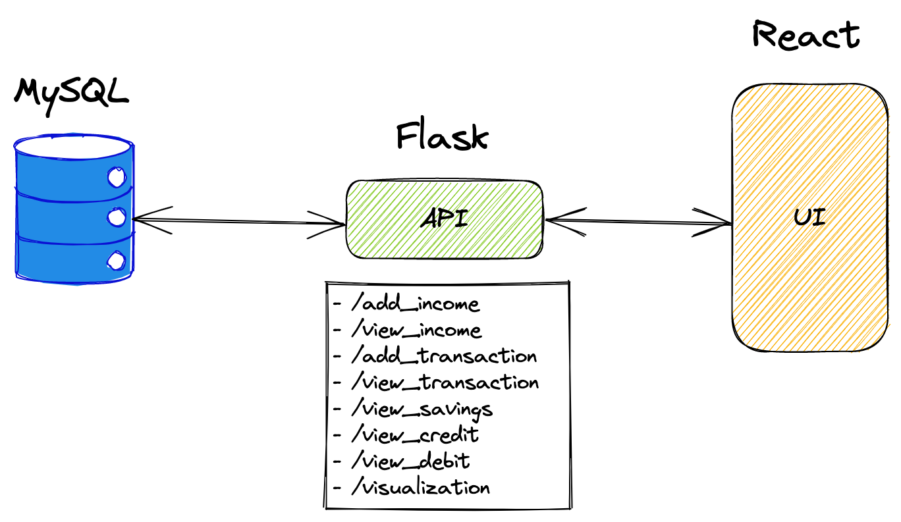

# Finance Tracker

## Funtional Requirements
- [ ] Allows for easy input of income
- [ ] Allows for easy input of transactions
- [ ] Allows me to compute my savings
- [ ] Can visualize my data
- [ ] Backed up in Excel format

## Things TODO:
- [ ] Create an Architecture Diagram
- [ ] Create a Wireframe
- [ ] Create the UI Design
- [ ] Figure out Backup Methods
- [ ] List out the Data Visualizations
- [x] Create a High Level Diagram
- [x] List out all the API Endpoints

## High Level Diagram

### List of API Endpoints
- /add_income
- /view_income
- /add_transaction
- /view_transaction
- /view_savings
- /view_credit
- /view_debit
- /visualization